# Map集合

一个Map集合中可以包含大量的Map.Entry<K,V>接口的实例化对象, 这些K-V对象按照一定的规则进行存储. 存储规则由实现Map接口的具体集合进行管理.

## 顶层接口和抽象类

### Map接口替代Dictionary<K,V>

[Map接口类](/src/java/util/Map.java) 用来替代jdk1.0中的[Dictionary抽象类](src/java/util/Dictionary.java) 

[Map.java](src/java/util/Map.java)接口其实更像一个抽象类 
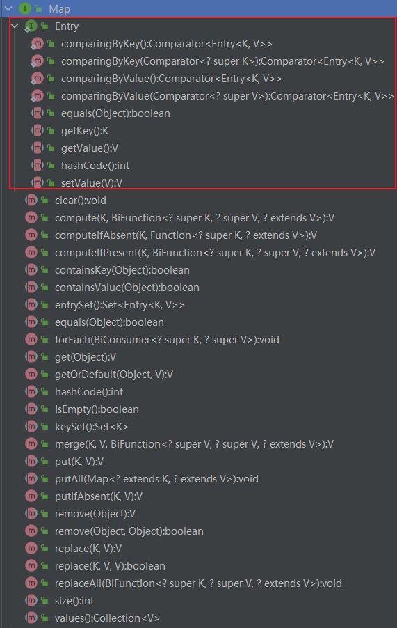

### AbstractMap抽象类
[AbstractMap.java](src/java/util/AbstractMap.java)
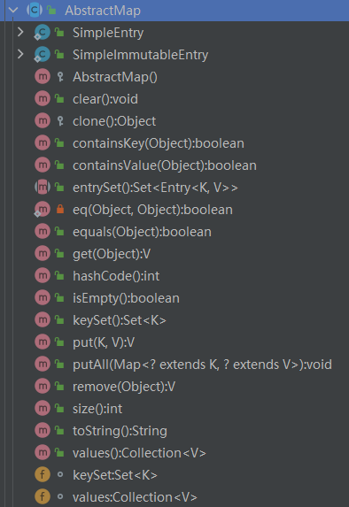

### Map接口与AbstractMap抽象类

[AbstractMap抽象类](src/java/util/AbstractMap.java)实现了[Map接口类](src/java/util/Map.java), AbstractMap抽象类存在的意义在于提供Map接口的骨架实现, 最大限度地减少实现Map接口所需的工作量.
#### Map.Entry<K,V>
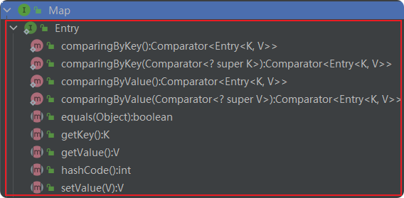
AbstractMap.SimpleEntry类, HashMap.Node类, TreeMap.Entry类都实现了Map.Entry接口, 都根据自己存储的K-V对Entry做出了不同的调整和扩展.
#### Map接口的方法
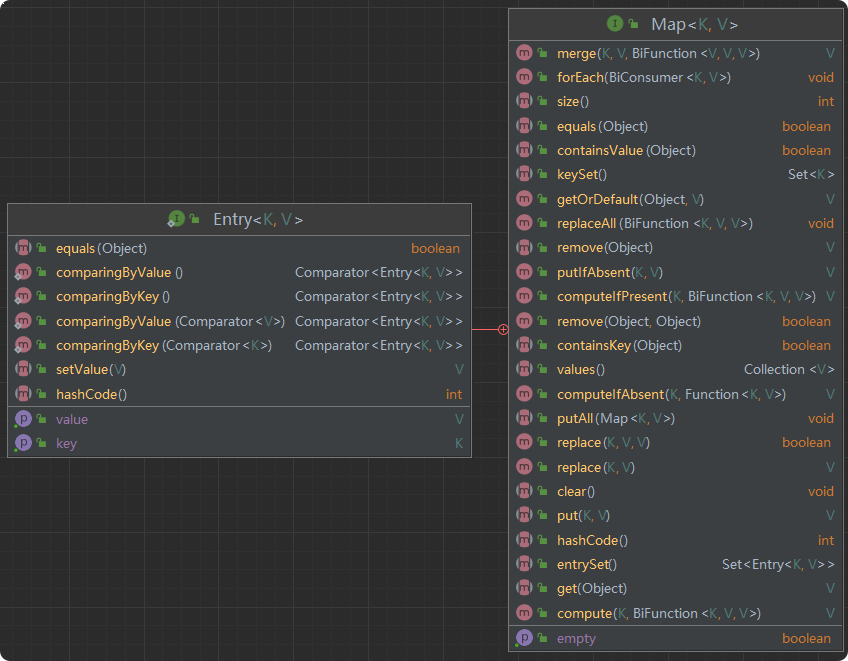

## 其他几个接口

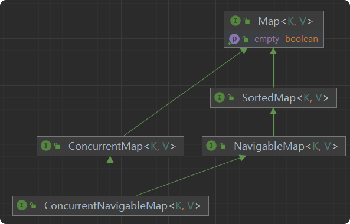
- [SortedMap接口](src/java/util/SortedMap.java) 
- [NavigableMap接口](src/java/util/NavigableMap.java) 
- [ConcurrentMap接口](src/java/util/concurrent/ConcurrentMap.java) 
- [ConcurrentNavigableMap接口](src/java/util/concurrent/ConcurrentNavigableMap.java) 

### SortedMap接口
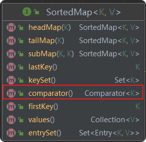 
有序存储并非线性存储, 如利用红黑树结构进行的存储.

### NavigableMap接口: 进一步细化SortedMap接口的操作
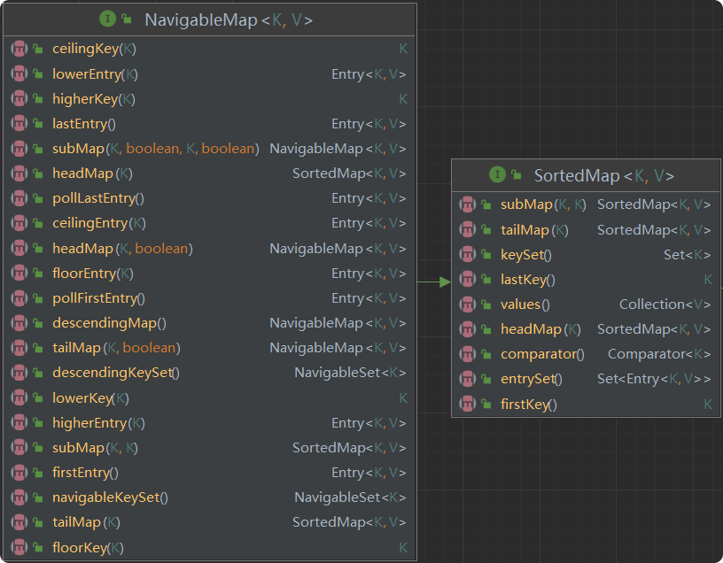

### ConcurrentMap接口
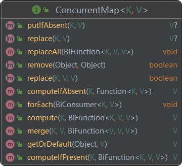

### ConcurrentNavigableMap接口
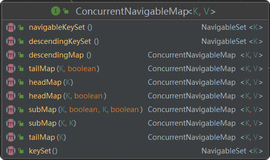

## 具体实现类

### 4个普通的HashMap集合

#### HashMap

#### LinkedHashMap

#### WeakHashMap

#### IdentityHashMap

### ConCurrentSkipListMap和ConcurrentHashMap

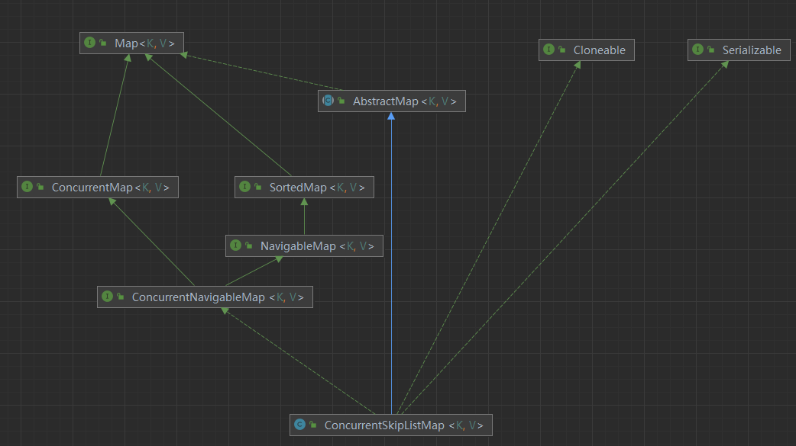 
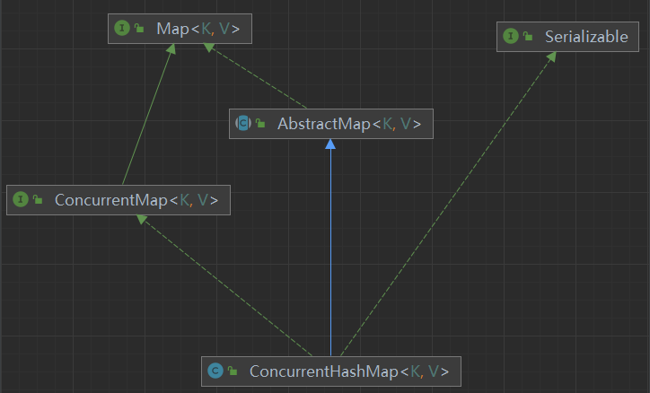

### 其他几种集合

#### TreeMap

#### Hashtable与Properties

#### EnumMap

#### 其他:java.util.jar包下的Attributes

