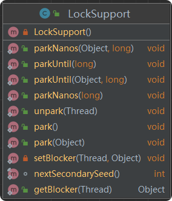

# 信号

主要基于AQS技术, 用于解决线程间的同步和互斥问题, 即解决多个线程的执行顺序控制问题.

[Semaphore类](src/java/util/concurrent/Semaphore.java) 

[CyclicBarrier类](src/java/util/concurrent/CyclicBarrier.java) 

[CountDownLatch类](src/java/util/concurrent/CountDownLatch.java) 

## LockSupport工具类

LockSupport工具类属于AQS框架的底层支持部分, 主要用于线程元语级别的执行/阻塞控制. 

- park()方法: 使当前线程进入阻塞
- unpark()方法: 使线程退出阻塞

上面两个方法类似ObjectMonitor模式下的wait()方法和notify()方法, 但park()和unpark()更灵活, 无须关注两个或多个相互作用线程的执行顺序, 也无须像wait()方法和notify()方法那样配合使用(wait()先, notify()后)