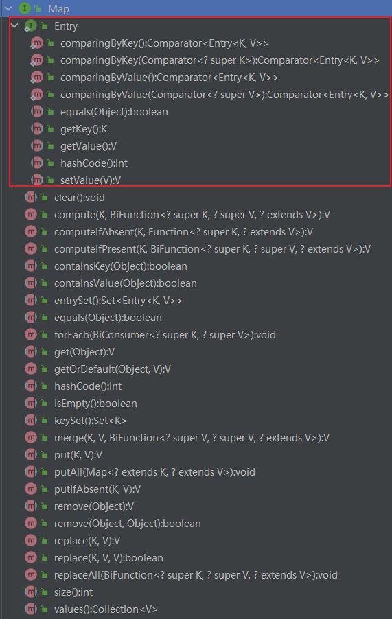
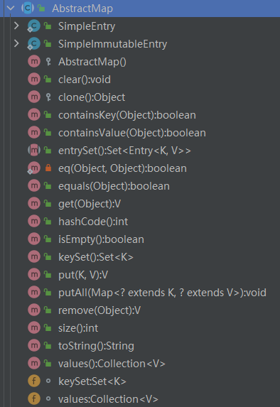
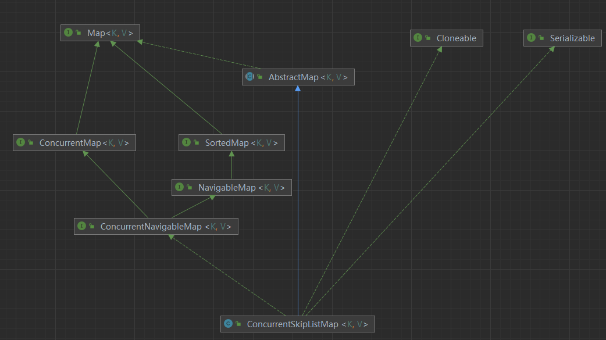
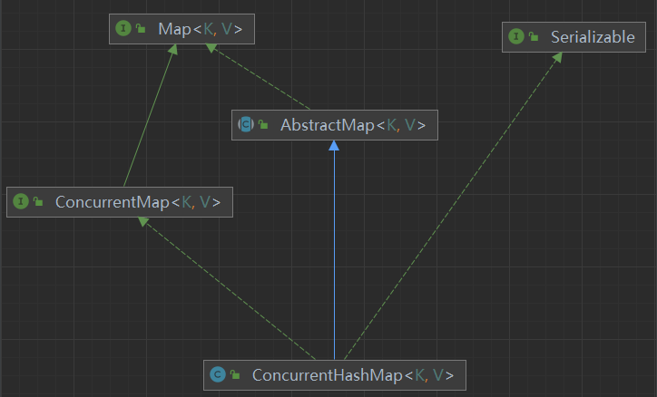

# Map集合

## 顶层接口和抽象类

### 过时的Dictionary<K,V>

[Map接口类](src/java/util/Map.java) 用来替代jdk1.0中的[Dictionary抽象类](src/java/util/Dictionary.java) 

[Map.java](src/java/util/Map.java)接口其实更像一个抽象类 

### AbstractMap抽象类
[AbstractMap.java](src/java/util/AbstractMap.java)

### Map接口与AbstractMap抽象类

[AbstractMap抽象类](src/java/util/AbstractMap.java)实现了[Map接口类](src/java/util/Map.java), AbstractMap抽象类存在的意义在于提供Map接口的骨架实现, 最大限度地减少实现Map接口所需的工作量.

## 具体实现类

### 4个普通的HashMap集合

#### HashMap

#### LinkedHashMap

#### WeakHashMap

#### IdentityHashMap

### ConCurrentSkipListMap和ConcurrentHashMap

 

### 其他几种集合

#### TreeMap

#### Hashtable与Properties

#### EnumMap

#### 其他:java.util.jar包下的Attributes

