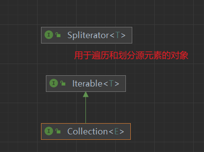

### 三个顶级接口: Collection<E>, Iterable<T>, Spliterator<T>

Collection的继承关系: 

- [java.util.Collection接口](src/java/util/Collection.java)以及下一级的接口或抽象类起到聚合作用(主要针对Queue, Set, List), 并非所有的集合类都实现了Collection接口
- [java.lang.Iterable](src/java/lang/Iterable.java)提供了两个方法forEach(Consumer<? super T> action)方法和jdk1.8加入的spliterator()方法 
其中forEach(Consumer<? super T> action)的Consumer涉及到[java.util.functin](ju.function.md)(jdk1.8提供的函数式接口)
- [java.util.Spliterator接口](src/java/util/Spliterator.java)为jdk1.8加入的可分割迭代器, 为了并行遍历数据源中的元素而设计的迭代器. 相比早期Iterator, 区别在于一个顺序遍历, 一个并行遍历.

#### Collection<E>接口而不是Collections类
[Collections类](src/java/util/Collections.java)是一个工具类, 与Collection<E>接口命名相似

#### 两个迭代器的对比: Iterator - Spliterator

### 一个标识接口: RandomAccess接口
[RandomAccess接口](src/java/util/RandomAccess.java)一个标识接口, 只是用来标识某个类具有某种功能类型.这里用来表明其支持快速(通常是固定时间)随机访问, 此接口的目的主要是允许一般的算法更改其行为, 从而在将其应用到随机或连续访问[List](jcf-list.md)时候能提供良好的性能. 

其他的类似接口比如: 
- [Cloneable接口](src/java/lang/Cloneable.java): 表明Object.clone()方法可以合法地对该类实例进行按字段复制,没有实现该接口的实例调用Object的clone方法会抛出CloneNotSupportedException异常
- [Serializable接口](src/java/io/Serializable.java):未实现此接口的类将无法使其任何状态序列化或反序列化. 为了保证serialVersionUID值跨不同的java编译器实现的一致性, 序列类必须声明一个明确的serialVersionUID值
- [Remote接口](src/java/rmi/Remote.java):标识其方法可以从非本地虚拟机上调用的接口. 任何远程对象都必须直接或间接实现此接口

#### java.util.AbstractList抽象类